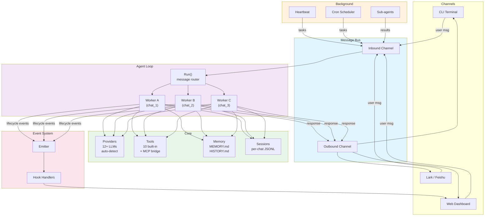
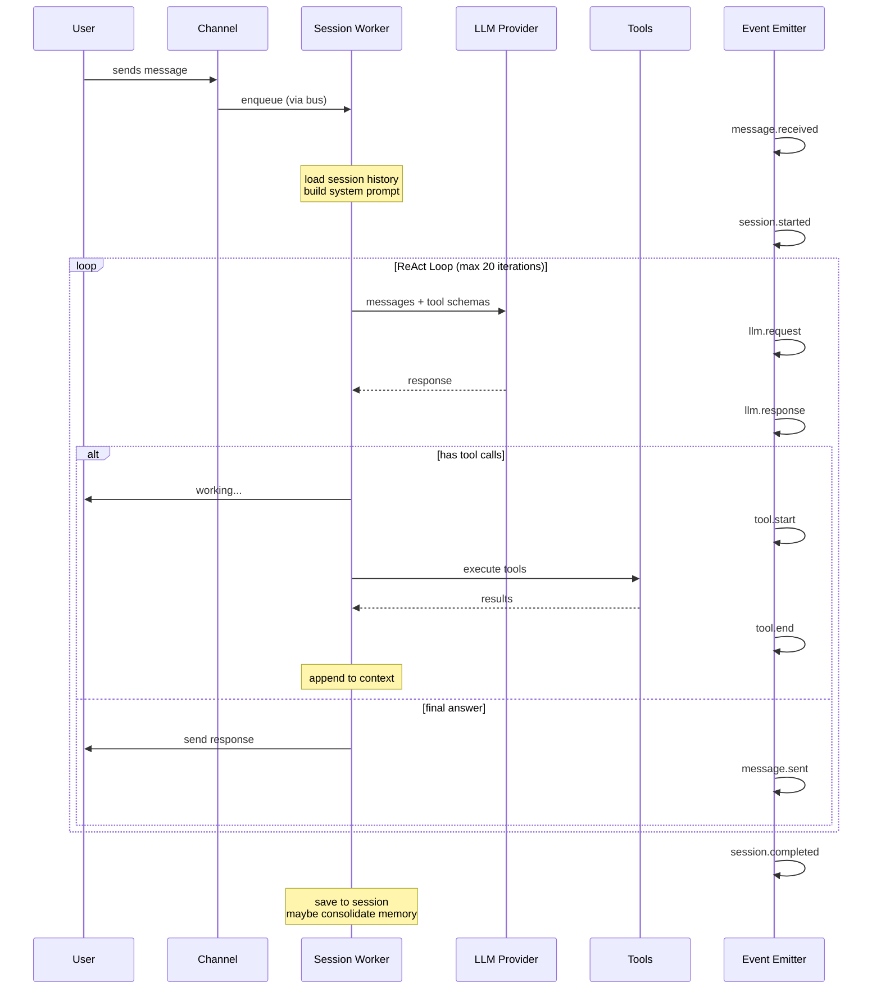
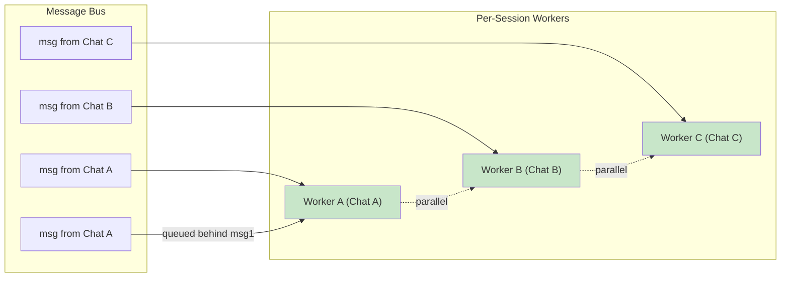
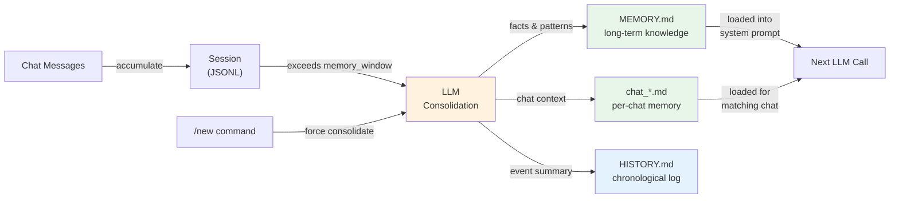

# Nano-bot-go (ALias Monet-bot)

A lightweight, concurrent team agent built in Go. Inspired by [nanobot](https://github.com/HKUDS/nanobot).

Built for the [CCMonet](https://ccmonet.ai) team — an AI-powered accounting platform. monet-bot is the team member that never sleeps: investigating bugs, running standups, monitoring services, and answering questions about the codebase.

## Why

nanobot proved that a full-featured AI agent can fit in ~4,000 lines of Python. monet-bot takes the same philosophy — minimal footprint, maximum capability — and rewrites it in Go with a focus on **concurrent session processing** and **team-oriented workflows**.

| | nanobot (Python) | monet-bot (Go) |
|---|---|---|
| Core code | ~4,000 lines | ~5,000 lines |
| Runtime | Single-thread asyncio | Multi-goroutine, per-session workers |
| Cross-chat concurrency | Serialized (global lock) | Fully parallel |
| Same-chat concurrency | Serialized | Fully parallel |
| Tool isolation | Shared singleton | Per-request clone |
| Compilation | Interpreted | Single static binary |

## Architecture



### Message Lifecycle

Each user message goes through a ReAct (Reason + Act + Observe) loop:



## Features

### Hook / Event System

A lightweight publish-subscribe system that emits lifecycle events throughout the agent loop. Hooks receive real-time notifications for 13 event types:

| Event | Emitted When |
|-------|-------------|
| `message.received` | User message arrives |
| `message.sent` | Bot sends a response |
| `session.started` | Processing begins |
| `session.completed` | Processing finishes |
| `session.cancelled` | Session cancelled |
| `llm.request` | LLM API call starts |
| `llm.response` | LLM API call returns |
| `tool.start` | Tool execution begins |
| `tool.end` | Tool execution finishes |
| `memory.updated` | Memory consolidation runs |
| `command.executed` | Slash command processed |
| `subagent.started` | Sub-agent spawned |
| `subagent.completed` | Sub-agent finishes |

The Emitter is nil-safe — when no hooks are registered (dashboard disabled), all emit calls are zero-cost no-ops.

### Web Dashboard

A built-in web UI served from a single embedded HTML file. Acts as both a **Channel** (send/receive messages) and a **Hook** (display lifecycle events).

**Chat View** — Clean conversation interface with:
- User and assistant message bubbles
- Collapsible "thinking" blocks that group internal events (LLM calls, tool executions) into a single expandable section, similar to Claude Code's interface
- Markdown rendering for assistant responses (code blocks, bold, italic, lists, tables, blockquotes)
- Real-time WebSocket updates

**Events View** — Raw event firehose for debugging, filterable by session.

```json
{
  "dashboard": {
    "enabled": true,
    "port": 8080
  }
}
```

When enabled, the dashboard is accessible at `http://localhost:<port>`. Late-joining clients receive the last 200 events from a ring buffer.

### LLM Providers
Auto-detection from API key or model name. 12+ providers supported:

OpenRouter, OpenAI, Anthropic Claude, Google Gemini, DeepSeek, Groq, Alibaba DashScope (Qwen), Moonshot (Kimi), SiliconFlow, VolcEngine (Doubao), Zhipu GLM, MiniMax

Plus any OpenAI-compatible endpoint via `base_url` override.

**Prompt caching** for Anthropic/OpenRouter. **Model-specific overrides** (temperature clamping for kimi-k2.5, deepseek-r1, etc.). **Tolerant JSON repair** for models with sloppy tool-call output.

### Concurrent Session Processing



- **Different chats** -> fully parallel (separate goroutines, isolated tool state)
- **Same chat** -> fully parallel (each message gets its own goroutine)
- **New message while busy** -> immediate ack
- **`/stop`** -> cancels the current task (queued messages still process)

### Tools (10 built-in + MCP)

| Tool | Description |
|------|-------------|
| `read_file` | Read files from workspace/repos |
| `write_file` | Write files (workspace only) |
| `edit_file` | Search-and-replace edits |
| `list_dir` | Directory listing |
| `exec` | Shell commands (sandboxed to workspace) |
| `query_api` | HTTP GET to configured services |
| `web_fetch` | Fetch and extract from URLs |
| `web_search` | Brave Search API |
| `message` | Send messages to any channel |
| `spawn` | Launch background sub-agents |
| `cron` | Dynamic scheduled tasks |

**MCP (Model Context Protocol)**: Connect external tool servers via stdio or HTTP transport. Tools are discovered at startup and registered natively — the LLM calls them like any other tool.

### Skills (Markdown-driven)

Skills are markdown files in `workspace/skills/` with frontmatter:

```markdown
---
name: standup
description: Generate daily standup from git activity
always_on: false
---

# Steps
1. Pull latest from all repos
2. Run `git log --since='1 day ago'` per repo
3. Group commits by person
4. Format as team standup
```

The agent reads the skill file as a playbook and follows the steps. No code changes needed to add new skills.

### Memory System

Two-tier LLM-powered memory with per-chat context:



- **MEMORY.md** — Long-term facts (team patterns, architecture decisions, recurring issues)
- **chat_*.md** — Per-chat memory (ongoing investigations, project context, decisions in progress)
- **HISTORY.md** — Chronological event log (searchable via grep)

Auto-consolidation triggers when unconsolidated messages exceed `memory_window`. The LLM extracts knowledge from old messages and merges it into MEMORY.md. Manual trigger via `/new`. Memory auto-compresses when it exceeds `max_memory_bytes`.

### Team Identity Map

`workspace/TEAM.md` maps developers across platforms:

```
- ddx (ddx510) | github: ddx-510 | lark: ou_123456...
  - git aliases: ddx-510
```

Auto-learned from Lark @mentions. The agent uses this to attribute code ownership (`git blame` -> person -> Lark @mention).

### Heartbeat (LLM-powered)

Periodic health checks driven by `HEARTBEAT.md`. The LLM decides whether to skip or run based on context:

```json
{
  "heartbeat": {
    "enabled": true,
    "interval_minutes": 30
  }
}
```

The agent reads HEARTBEAT.md, evaluates the checklist (health endpoints, git logs, queue status), and only reports if something is actually wrong.

### Channels

- **CLI** — Interactive terminal for local development
- **Lark (Feishu)** — Enterprise messaging with @mention support, rich text parsing, image attachments
- **Web Dashboard** — Built-in browser UI with chat and event monitoring

## Quick Start

### Prerequisites
- Go 1.23+
- An LLM API key (any supported provider)

### Build & Run

```bash
git clone https://github.com/PlatoX-Type/monet-bot.git
cd monet-bot

# Build
go build -o monet-bot .

# Configure
cp config.example.json config.json
# Edit config.json with your API key and settings

# Run (CLI mode)
./monet-bot run --channel cli

# Run (Lark mode)
./monet-bot run --channel lark

# Run (all channels)
./monet-bot run --channel all
```

### Minimal Config

```json
{
  "workspace": "./workspace",
  "llm": {
    "provider": "gemini",
    "model": "gemini-2.5-flash",
    "api_key": "your-api-key",
    "max_tokens": 8192,
    "temperature": 0.3
  },
  "repos": [],
  "services": [],
  "channels": [],
  "max_iterations": 20,
  "memory_window": 50
}
```

The `provider` field is optional — monet-bot auto-detects from the API key prefix or model name.

## Configuration Reference

### LLM

| Field | Type | Default | Description |
|-------|------|---------|-------------|
| `provider` | string | auto-detect | Provider name (optional) |
| `model` | string | — | Model identifier |
| `api_key` | string | — | API key |
| `base_url` | string | auto | Override API endpoint |
| `max_tokens` | int | 8192 | Max response tokens |
| `temperature` | float | 0.3 | Sampling temperature |

### Repos

```json
{
  "name": "my-repo",
  "path": "repos/my-repo",
  "remote": "https://github.com/org/my-repo.git",
  "branch": "main"
}
```

Repos are cloned to `workspace/repos/` and auto-pulled every 10 minutes.

### Services

```json
{
  "name": "my-api",
  "base_url": "https://api.example.com",
  "health_path": "/health",
  "token": "Bearer xxx",
  "mcp_url": "https://mcp.example.com/sse",
  "mcp_cmd": "npx -y @modelcontextprotocol/server-github"
}
```

Services are available via the `query_api` tool. If `mcp_url` or `mcp_cmd` is set, the MCP client connects at startup and registers discovered tools.

### Channels

```json
{
  "type": "lark",
  "enabled": true,
  "app_id": "cli_xxx",
  "app_secret": "xxx",
  "allow_from": ["oc_xxx"]
}
```

`allow_from` restricts which Lark group chats the bot responds to. Empty = respond to all.

### Dashboard

```json
{
  "dashboard": {
    "enabled": true,
    "port": 8080
  }
}
```

| Field | Type | Default | Description |
|-------|------|---------|-------------|
| `enabled` | bool | false | Enable the web dashboard |
| `port` | int | 8080 | HTTP server port |

### Cron Jobs

```json
{
  "cron": [
    {
      "name": "morning-standup",
      "schedule": "0 9 * * MON-FRI",
      "task": "Run the standup skill and send to the team channel"
    }
  ]
}
```

Cron expressions follow standard 5-field format. The `task` is injected as a user message to the agent.

### Other Settings

| Field | Type | Default | Description |
|-------|------|---------|-------------|
| `max_iterations` | int | 20 | Max ReAct loop iterations per message |
| `memory_window` | int | 50 | Messages before auto-consolidation |
| `max_memory_bytes` | int | 4096 | Max MEMORY.md size before auto-compression |
| `brave_api_key` | string | — | Brave Search API key |
| `send_progress` | bool | true | Send "working..." progress messages |
| `send_tool_hints` | bool | false | Show detailed tool call descriptions |

## Commands

| Command | Description |
|---------|-------------|
| `/help` | Show available commands |
| `/stop` | Cancel the current task |
| `/new` | Save memory & clear session |
| `/memory` | Show current team memory |
| `/skills` | List available skills |
| `/continue` | Respond to all messages (no @mention needed) |
| `/atmode` | Only respond when @mentioned (default) |

## Workspace Structure

```
workspace/
├── SOUL.md              # Bot persona and behavior rules
├── AGENTS.md            # Agent behavior instructions
├── TEAM.md              # Team identity map (auto-updated)
├── HEARTBEAT.md         # Periodic health check tasks
├── skills/
│   └── ...              # Custom skills
├── repos/
│   ├── ccmonet-go/      # Cloned repos (read-only)
│   ├── ccmonet-web/
│   └── curiosity/
├── memory/
│   ├── MEMORY.md        # Long-term team memory
│   ├── HISTORY.md       # Chronological event log
│   └── chat_*.md        # Per-chat memory files
└── sessions/
    └── lark_xxx.jsonl   # Per-chat session history
```

## Project Structure

```
monet-bot/
├── main.go              # Entry point
├── cmd/root.go          # CLI commands (cobra)
├── config/config.go     # Configuration loading
├── bus/bus.go           # Message bus (inbound/outbound channels)
├── agent/
│   ├── loop.go          # ReAct loop, concurrent session workers
│   ├── context.go       # System prompt builder
│   ├── session.go       # JSONL session persistence (thread-safe)
│   ├── memory.go        # LLM-powered memory consolidation
│   └── skills.go        # Skill loader
├── providers/
│   └── provider.go      # 12+ LLM providers, auto-detection, JSON repair
├── tools/
│   ├── tool.go          # Tool interface
│   ├── registry.go      # Tool registry with Clone()
│   ├── filesystem.go    # read_file, write_file, edit_file, list_dir
│   ├── shell.go         # exec
│   ├── web.go           # web_fetch, web_search
│   ├── query_api.go     # HTTP service queries
│   ├── message.go       # Cross-channel messaging
│   ├── spawn.go         # Sub-agent spawning
│   ├── cron.go          # Dynamic cron management
│   └── mcp.go           # MCP client (stdio + HTTP)
├── hooks/
│   └── hooks.go         # Event types, Hook interface, Emitter
├── dashboard/
│   ├── dashboard.go     # HTTP server, WebSocket, Channel + Hook
│   ├── hub.go           # WebSocket connection hub
│   └── static/
│       └── index.html   # Embedded SPA (chat + events UI)
├── channels/
│   ├── channel.go       # Channel interface
│   ├── cli.go           # Terminal channel
│   └── lark.go          # Lark/Feishu channel
├── heartbeat/
│   └── service.go       # LLM-powered periodic tasks
├── cron/
│   └── service.go       # Cron scheduler (robfig/cron)
└── repos/
    └── manager.go       # Git repo cloning and auto-pull
```

~5,500 lines of Go. Single binary. No runtime dependencies.

## Credits

- Inspired by [nanobot](https://github.com/HKUDS/nanobot) — the ultra-lightweight Python AI assistant framework from HKUDS
- Built for [CCMonet](https://ccmonet.ai) — AI-powered accounting for modern finance teams

## License

MIT
